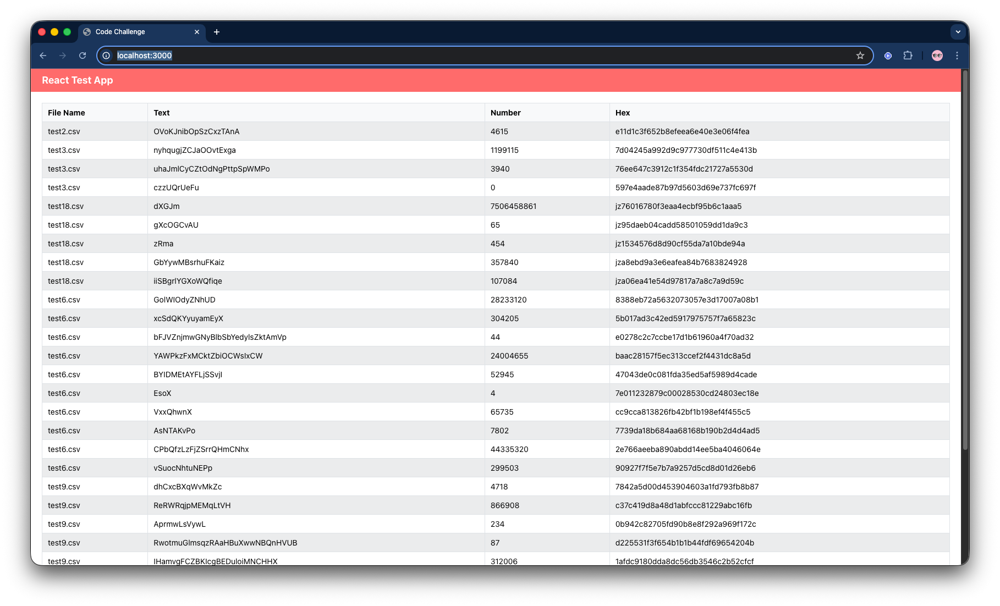
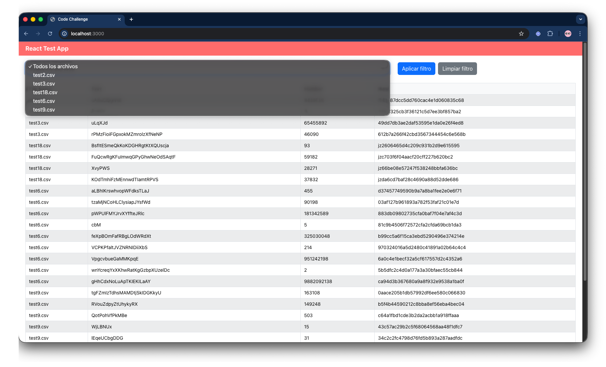
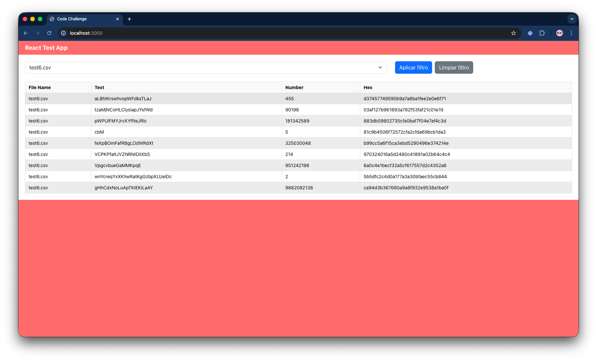

# Code Challenge

Una aplicación full-stack que procesa archivos CSV desde una API externa y los muestra en una interfaz web React, con la capacidad de obtener los datos por archivo.





## Inicio Rápido con Docker

```bash
git clone <repository-url>
cd code-challenge

docker-compose up --build
```

**¡Listo!** 
- Frontend: http://localhost:3000
- Backend: http://localhost:3001


## Tecnologías Utilizadas

### Backend
- **Node.js 14** - Runtime de JavaScript
- **Express.js** - Framework web
- **Mocha + Chai** - Testing framework
- **ES6 Modules** - Sintaxis moderna

### Frontend
- **React.js** - Librería de UI
- **React Bootstrap** - Componentes de interfaz
- **Redux** - Manejador de estado
- **Webpack** - Bundler y dev server
- **ES6+** - JavaScript moderno

### DevOps
- **Docker** - Containerización
- **Docker Compose** - Orquestación de servicios
- **Nginx** - Servidor web para producción

## Desarrollo Local

### Prerrequisitos
- Node.js 16.x
- npm

### Backend
```bash
cd packages/backend
npm install
npm run dev
npm test
```

### Frontend
```bash
cd packages/frontend
npm install
npm run dev
npm run build
```

## Comandos Docker

```bash
docker-compose up --build

# Solo backend
docker-compose up backend

# Solo frontend
docker-compose up frontend

# Ver logs
docker-compose logs -f

# Limpiar
docker-compose down
docker system prune -f
```

## API Endpoints

### Backend (http://localhost:3001)

| Endpoint | Método | Descripción |
|----------|--------|-------------|
| `/health` | GET | Estado del servidor |
| `/files/data` | GET | Procesa y retorna archivos CSV |
| `/api` | GET | Información de la API |

---

**Desarrollado por Wilson David Alméciga usando Node.js, Express, React y Docker**